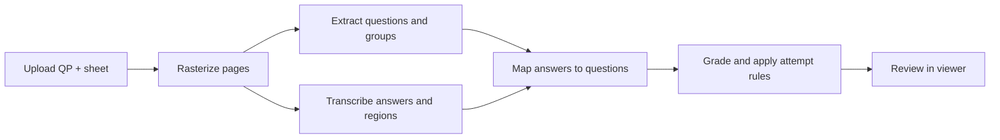

<p align="center">
  
</p>

<h1 align="center">VedaCheck</h1>

<p align="center">
  <strong>See exactly where each question was answered.</strong><br />
  Upload a question paper and one handwritten answer sheet — VedaCheck extracts, maps, highlights, and grades.
</p>

<p align="center">
  <a href="https://github.com/Manav-Chudasama/VedaCheck"></a>
  <a href="https://www.typescriptlang.org/"></a>
  <a href="https://platform.openai.com/"></a>
  <a href="https://bun.sh/"></a>
  
</p>

<p align="center">
  <a href="#-screenshots">Screenshots</a> ·
  <a href="#-features">Features</a> ·
  <a href="#-how-it-works">How it works</a> ·
  <a href="#-quick-start">Quick start</a> ·
  <a href="#-tech-stack">Tech stack</a>
</p>

---

## Screenshots

<table>
  <tr>
    <td width="50%" align="center" valign="top">
      <a href="public/images/upload-screen.png">
        
      </a>
      <br />
      <sub><b>Upload</b> — drop a question paper and one answer sheet (PDF or images)</sub>
    </td>
    <td width="50%" align="center" valign="top">
      <a href="public/images/ques-ans-mapping.png">
        
      </a>
      <br />
      <sub><b>Mapping</b> — grouped scores, AI feedback, and exact region highlights</sub>
    </td>
  </tr>
</table>

---

## Why VedaCheck?

Teachers shouldn’t hunt through a scanned booklet to find where `Q5(c)` was answered.

VedaCheck turns two uploads into a reviewable assessment:

| Before | After |
|:-------|:------|
| Flip pages looking for labels | Click a question → jump to the highlight |
| Guess which sub-part was attempted | Sub-parts listed as printed (`1(a)`, `1(f)`, …) |
| Manual “attempt any 5 of 7” math | Top-N scores count toward **Obtained X / Y** |
| Unclear blanks vs missing OCR | Unanswered and unmatched blocks called out |

Built for papers like MSBTE-style sections (“Attempt any FIVE… : 10 Marks”) as well as flatter question lists.

---

## Features

- **Dual upload** — question paper + one student answer sheet (PDF / PNG / JPEG / WebP)
- **Faithful extraction** — every labelled sub-part is its own question; numbering preserved exactly
- **Handwriting → text** — transcription plus normalized bounding boxes
- **Smart mapping** — out-of-order answers, unanswered questions, unmatched scribbles
- **Exact highlights** — not just the right page; multi-region and multi-page answers supported
- **Group-aware marks** — derive per-option marks from section totals; “attempt any N” selection
- **Optional AI grading** — per-question scores + short teacher-facing feedback
- **Live progress** — staged extracting UI with desktop horizontal stepper
- **Responsive viewer** — side-by-side on desktop; Questions / Answer Sheet tabs on mobile

---

## How it works



**UI stages:** Reading documents → Extracting questions → Reading handwritten answers → Mapping answers → Preparing assessment

Vision calls use **rasterized page images** (not raw PDFs). Coordinates are validated and scaled so overlays land on the displayed sheet.

---

## Quick start

**Needs:** [Bun](https://bun.sh) · [OpenAI API key](https://platform.openai.com/api-keys)

```bash
# 1. Install
bun install

# 2. Env
cp .env.example .env.local
```

```env
# .env.local — server-only; never prefix with NEXT_PUBLIC_
OPENAI_API_KEY=sk-...
# OPENAI_MODEL=gpt-4o   # optional override
```

```bash
# 3. Run
bun dev
```

Open **[http://localhost:3000](http://localhost:3000)** → upload both files → **Start Mapping**.

```bash
bun test      # unit tests with mocked AI (no live API)
bun run lint
```

> **Deploy tip:** set `OPENAI_API_KEY` in your host’s env dashboard. On Vercel, keep `sharp` / `pdfjs-dist` / `@napi-rs/canvas` in `serverExternalPackages` (already configured).

---

## Tech stack

| Area | Tools |
|------|--------|
| App | Next.js 16 · React 19 · TypeScript |
| UI | Tailwind CSS 4 · Shadcn UI · Radix · Lucide |
| AI | OpenAI **gpt-4o** · structured outputs · Zod |
| Documents | pdfjs-dist · sharp · @napi-rs/canvas |
| Client data | TanStack React Query |
| Tooling | Bun · Bun Test |

No authentication. No database. Jobs and page rasters live **in memory** for the session.

**Why gpt-4o?** Strong multimodal reading of printed papers and handwriting, plus reliable structured JSON for extraction, mapping, and grading on a free/paid OpenAI tier.

---

## Project structure

```text
vedacheck/
├── app/                      # App Router pages + /api/assessments/*
├── components/
│   ├── upload/               # Dropzones + start CTA
│   ├── processing/           # Extracting / progress screen
│   ├── viewer/               # Questions, sheet, highlights
│   └── layout/               # Shell, sidebar, header
├── lib/
│   ├── ai/                   # OpenAI client, prompts, schemas
│   ├── assessment/           # Pipeline, groups, bbox, store
│   └── documents/            # PDF / image → page WebP
├── public/images/            # Product screenshots + assets
├── DESIGN.md                 # UI tokens & layout rules
└── IMPLEMENTATION.md         # Build phases & decisions
```

---

## API

| | Endpoint | Notes |
|---|----------|--------|
| `POST` | `/api/assessments` | Multipart upload; starts the pipeline |
| `GET` | `/api/assessments/:id/status` | Stage + progress for polling |
| `GET` | `/api/assessments/:id/result` | Full view model when ready |
| `GET` | `/api/assessments/:id/pages/:n` | Answer-sheet page image |

---

## Assumptions & limits

- Clear scans / photos work best; heavy blur or extreme skew reduces accuracy
- Handwriting should be reasonably legible for transcription and grading
- Sessions are ephemeral — refresh or TTL clears in-memory jobs
- Large multi-page PDFs take longer (rasterization + several vision round-trips)
- Group marks are most accurate when the paper prints section totals and attempt rules clearly

---

## Docs

- [`IMPLEMENTATION.md`](IMPLEMENTATION.md) — phases, pipeline notes, OpenAI switch
- [`DESIGN.md`](DESIGN.md) — brand tokens, shell, viewer consistency
- [`AGENTS.md`](AGENTS.md) — product brief & engineering rules for agents

---
